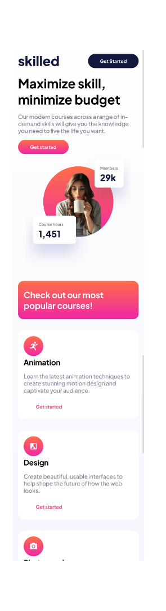
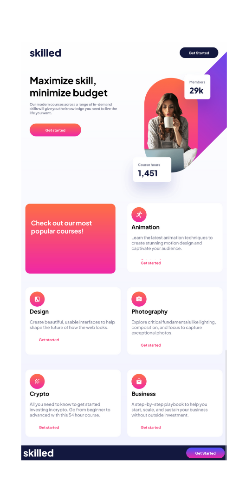
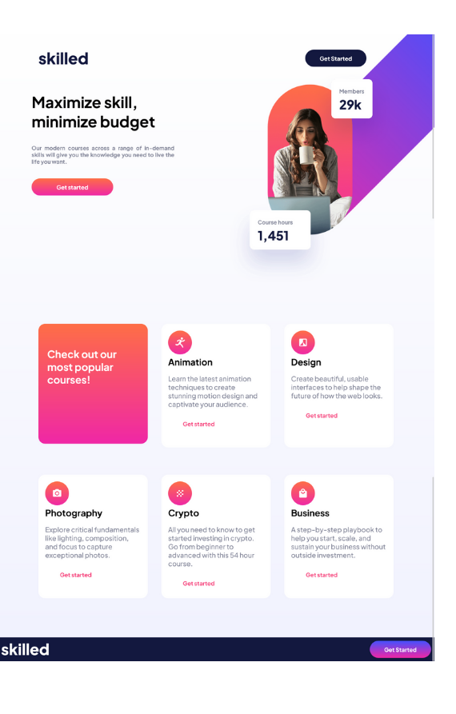

# Frontend Mentor - Skilled e-learning landing page solution

This is a solution to the [Skilled e-learning landing page challenge on Frontend Mentor](https://www.frontendmentor.io/challenges/skilled-elearning-landing-page-S1ObDrZ8q). 

## Table of contents

- [Overview](#overview)
  - [The challenge](#the-challenge)
  - [Screenshot](#screenshot)
  - [Links](#links)
- [My process](#my-process)
  - [Built with](#built-with)
  - [What I learned](#what-i-learned)
  - [Stuggles](#Stuggles)
  - [Author](#author)


## Overview

### The challenge

Users should be able to:

- View the optimal layout depending on their device's screen size
- See hover states for interactive elements

### Screenshot








### Links

- Solution URL: [ https://github.com/Jlovellealfeche/skilled-elearning-landing-page](https://your-solution-url.com)
- Live Site URL: [https://jlovellealfeche.github.io/skilled-elearning-landing-page/](https://your-live-site-url.com)

## My process

### Built with

- Semantic HTML5 markup
- CSS custom properties
- Flexbox
- CSS Grid 
- Mobile-first workflow
- SASS


### What I learned


*** <b>Notes on media queries breakpoints </b> *** 

```
@media screen and (max-width: 767px) {
<p>This is for mobile</p>
}

@media screen and (min-width: 768px) and (max-width: 1023px) {
    <p>This is for tablet</p>
}


@media screen and (min-width: 1024px) {
    <p>This is for desktop</p>
  
}

```

*** <b>Notes on usage of @use and @forward in sass partials </b> *** 

### Folder name Sass

  ||--<b>Abstract</b>--- _index.scss-->
  ```
   @forward './colors'; 
   @forward './breakpoints';
   @forwards './mixins';
  ```

  ||--<b>base</b>---_index.scss--> 
  ```
  
  @forward './base-styles'; 
  
  ```
            |--- _index.scss 

              ```
                  @forward './base-styles';
              ```

            |--- _base-styles.scss --> 
  
                ```
                  @use '../abstracts' as a; 

                  @use '../components' as c; 
                ```  

  ||--<b>components</b>
  |
  |

  ||<b>style.scss</b>----
    
      @use 'abstracts';
      @use 'base';
      @use 'components';


## Stuggles

i am really stuggling on how to style Images which Absolute values. 

The banner image was really difficult for me to tackle.


## Author

- GitHub - [https://github.com/Jlovellealfeche](https://www.your-site.com)
- Frontend Mentor - [@Jlovellealfeche](https://www.frontendmentor.io/profile/yourusername)


